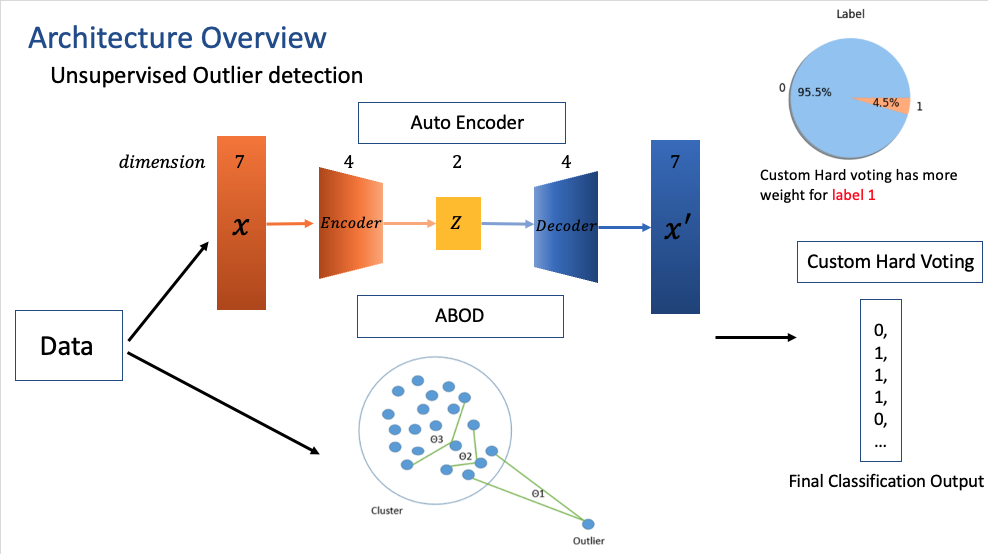

# 2023-AI-Factory-Diagnosing-Air-Compressor-faults  
AI solution that Classifies the abnomalies of Air Compressor

## Solution Overview


## Team member
|| | | |
|-|-|-|
|[Jiyul Ham](https://github.com/YUL-git)|[Jaeyoon Jung](https://github.com/lastdefiance20), Leader|[Hannah Yun](https://github.com/HannahYun)|[Hyundo Lee](https://github.com/onsemiro11)|

## File Structure
```
┖ figures
  ┖ ~
┖ dataset
  ┖ data ~
┖ del_feature.ipynb
┖ sub_with_reg_and_cls_422.ipynb
┖ numpy_selected_feature_5fold_original_300.npy
```

del_feature.ipynb
- Feature Selection using SHAP value for train fitted classification model

numpy_selected_feature_5fold_original_300.npy
- numpy array that contains the information of Selected Feature from `del_feature.ipynb`

sub_with_reg_and_cls_422.ipynb
- Train and Test the classification and regression model

## Dataset
We train and evaluate our model using the dataset from [Classifying Smart Factory Product Quality Status](https://dacon.io/en/competitions/official/236080/data)

we assume that you have downloaded it and placed based on File Structure, inside the dataset folder.

## Submission Process
1. Run All code in `del_feature.ipynb` to select important features and save in the `numpy_selected_feature_5fold_original_300.npy` file.

2. Run All code in `sub_with_reg_and_cls_422` to classify product quality using the regression model and classification model.
